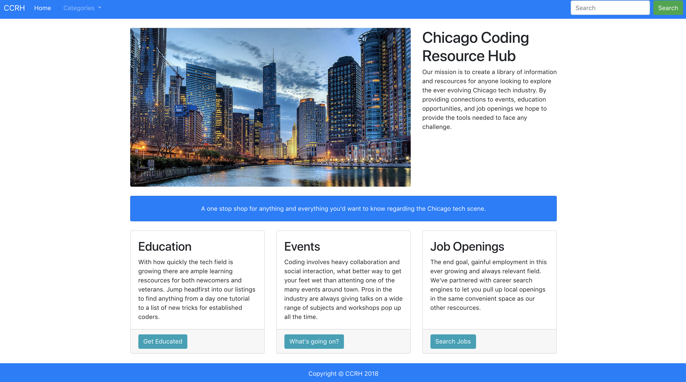

<a href="https://narwhalnancy.github.io/Group-Project-1/">
  <h1 align="center"> Chicago Coding Resources Hub </h1>
</a>

## Live Website

(https://narwhalnancy.github.io/Group-Project-1/)

    

## Table of Contents

- [About](#about)
- [Members](#members)
- [Features](#features)
- [Build Process](#build-process)
- [Live Website](#live-website)

## About

Chicago Coding Resource Hub is focused on bringing the right job applicant to the right company. We provide resources for job applicants to access educational information, job related events, and current job opportunities. There is built-in functionality to allow direct communication between applicants and companies via our message board. Ultimately, our goal is to create an enviroment that offers the most efficent relationship-building platform between developers and employers.

## Contributing Members

* [Kaleb Kougl](https://github.com/Kaleb-kougl)
* [Nick K](https://github.com/NKGreeneyes)
* [Mike Misiorowski](https://github.com/mmisiorowski)
* [Ruben Negrete](https://github.com/Ruben1016)
* [Dylan White](https://github.com/narwhalnancy)

## Features

* Three categories that query relevant APIs such as GitHub Jobs, Eventbrite, and Khanacademy when clicked and then display job listings, educational materials, and events based on which selection is checked.
* A message board that allows users to leave persistent messages that are displayed to other users. The most recent message is stored in Firebase to be displayed on the next visit.
* 

## Built With
* [Heroku Cross-Origin Redirect API] (https://cors-anywhere.herokuapp.com/)
* [Firebase](https://console.firebase.google.com/u/0/)
* [GitHub Jobs API](https://jobs.github.com/api)
* [Eventbrite API](https://www.eventbrite.com/platform/api)
* [Khan Academy API Explorer] (http://api-explorer.khanacademy.org/)
* [jQuery] (https://code.jquery.com/)
* [Bootstrap] (https://getbootstrap.com/)
* [Bootstrap Small Business Template] (https://startbootstrap.com/template-overviews/small-business/)
* HTML/CSS/JavaScript
* Trello for project management and assignment of tasks!

## Installation

Be sure to set up your own [Firebase](https://console.firebase.google.com/u/0/) and initialize it in your main JS file in place of ours.

## Issues Related To Project

* Search by keyword functionality implemented, but not properly explained to the user yet.
* Condense firebase to being called once for all pages.
* Improve UX for user clarity.
* Add mailboxlayer API to check for valid email addresses.
* Chatbox, beautify formatting.
* Use Moment.js to add timestamps to chat messages?
* Change badges in queryPage to be two badges, one to say submit a message and the other to collapse the divs in query listings for easier scrollability, particularly jobs/events.
* Add more parameters to query listings for more descriptive listings, e.g. Employer Name, Location.
* Check out Chicago's open data sets, see how they can be integrated.
* Gain access to Google Maps API, include business locations in small div within listing.
* Glassdoor API? Show rating of company, former employee reviews, etc.
* Move away from Bootstrap, do more home-grown CSS and possibly Materialize.
* Build animated landing page.
* Feed doesn't seem to load on the first click of the radio toggle buttons? Loading wheel spins, plays, and then the feed doesn't load. It takes a couple of clicks to get it to work.

## How To Contribute

Feel free to submit your own issues and PRs for more questions!